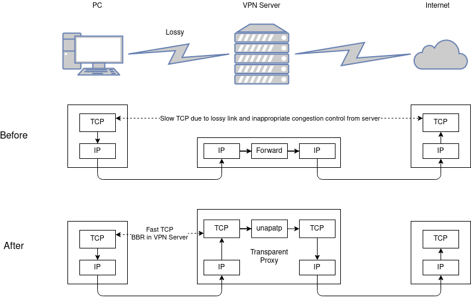

## UNATATP

**U**serspace **NAT** is **A**lso a **T**CP (**T**ransparent) **P**roxy 

This is a userspace NAT for TCP that works with iptables [TPROXY](https://www.kernel.org/doc/Documentation/networking/tproxy.txt) target.
Simply put, in your router, you configure iptables to redirect TCP traffics
to `unatatp` and `unatatp` will make new TCP connections to the destination on its behalf
and forward traffic between them.

### Use case

I use `unatatp` to transparently improve TCP performance in my VPN gateway.

I use UDP-based VPN to access the Internet from China
(because [TCP-over-TCP is a bad idea](http://sites.inka.de/bigred/devel/tcp-tcp.html)
and I don't like application-level proxy solution since it cannot be applied globally to all traffics).
My VPN link is lossy so the performance (network throughput) isn't ideal.
Modern TCP congestion control algorithms like BBR can greatly improve this situation
but it needs to be deployed in the server endpoint.
Using `unatatp` in the VPN gateway, the TCP CC algorithm being used on the VPN link
is essentially the one in the VPN gateway, which is under my own control and
can improve the overall performance.



### How-to

*Do not copy and paste. Be caution with the network config. You may lose access to your remote machine if configured incorrectly.*
*You should understand details about iptables and ip command to use this.*

Build and run unatatp:

```
go build
./unatatp -port 9999
# Or to use systemctl:
cp unatatp /usr/local/bin/
cp unatatp@.service /etc/systemd/system/
systemctl start unatatp@9999
```

Configure system:
```
# Add route table and policy so that packets can be delivered to local
ip rule add fwmark 0x100/0xf00 lookup 100
ip route add local default dev lo scope host 

# Redirect traffics to local port (unatatp process), trigger route recheck
iptables -t mangle -A PREROUTING -p tcp -s 192.168.0.0/24 -j TPROXY --to-ip 127.0.0.1 --to-port 9999 --tproxy-mark 0x100/0xf00
iptables -t mangle -A PREROUTING -m socket --transparent -j MARK --set-mark 0x100/0xf00

```

### Limitations

This is a NAT instead of a full transparent proxy. Full transparent
can be supported using IP_TRANSPARENT in outgoing socket, but I don't need it in my use case.
It may be supported in the future.

For the same reason, IPv6 is not supported for now.
